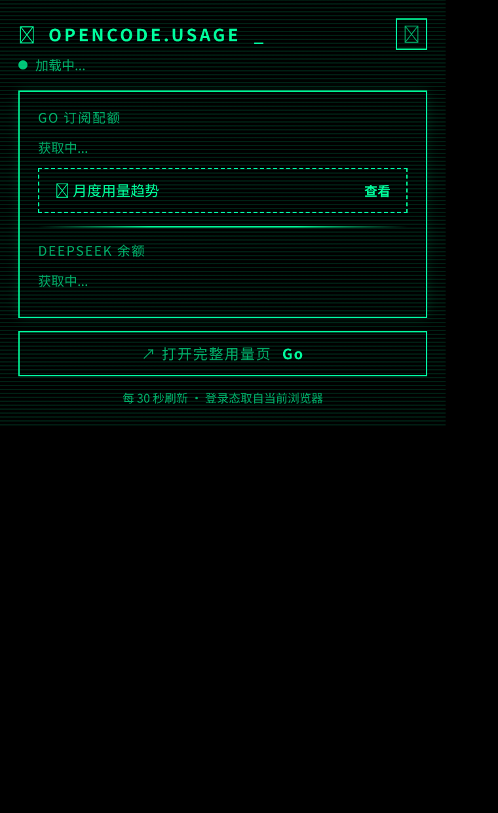
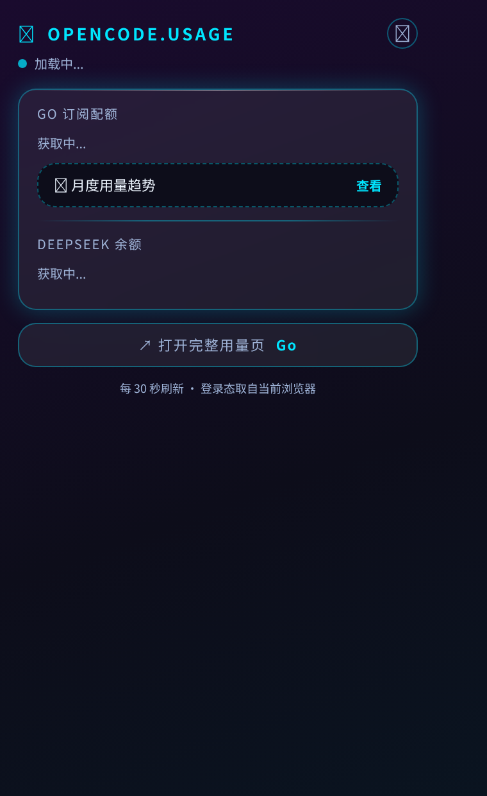
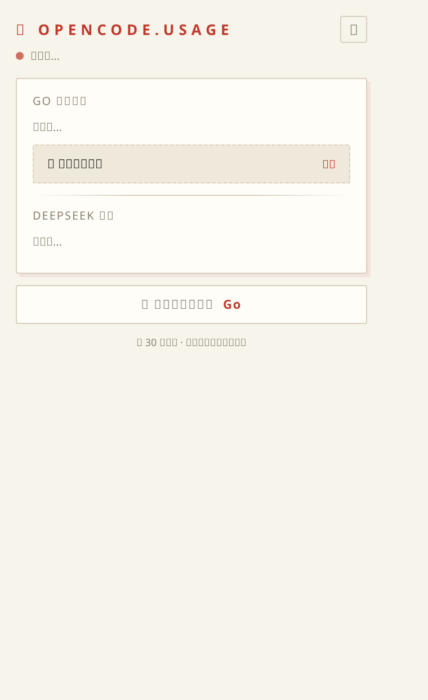
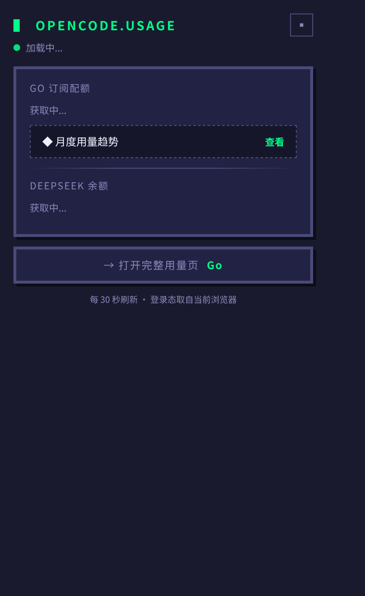
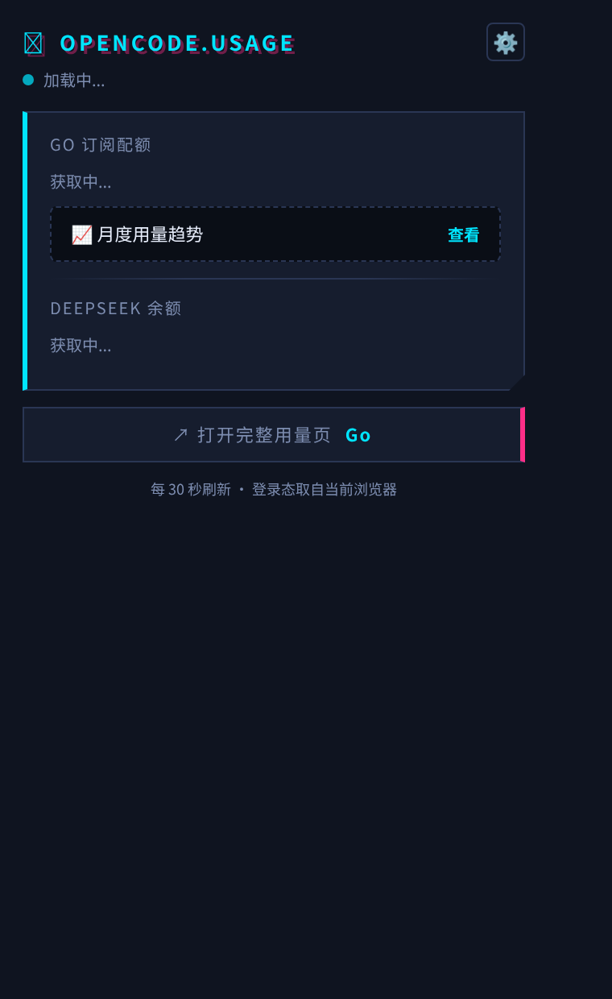

# OpenCode Usage Monitor · 用量监控扩展

> 在浏览器工具栏实时查看 OpenCode（Zen/Go）订阅配额与 DeepSeek 账户余额的 Edge/Chrome 扩展。

  

---

## ✨ 功能特性

| 功能 | 说明 |
|---|---|
| 📊 **Go 订阅配额** | 滚动 / 周 / 月三周期使用百分比 + 进度条 + **重置倒计时（天/时/分）** |
| 💰 **DeepSeek 余额** | 显示账户余额（可选启用，Key 仅存本地浏览器） |
| 🛡 **工具栏角标** | 图标直接显示所选数值百分比，颜色分级（<50% 绿 / >50% 橙 / >80% 红） |
| 🎨 **5 种界面风格** | 终端矩阵 / 玻璃拟态 / 极简记账 / 复古像素 / 赛博朋克，一键切换 |
| ⚡ **自定义刷新频率** | 支持任意秒数（≥1s），popup 打开期间按所设频率实时刷新 |
| ⏱ **倒计时本地递减** | 配额重置时间在前端逐秒递减，无需频繁请求 |
| 🔗 **官网入口** | 一键跳转 OpenCode 完整用量明细页 |
| 🔒 **隐私友好** | 数据全部在浏览器本地处理，无追踪、无远程服务器 |

## 📸 截图

| 终端矩阵 | 玻璃拟态 | 极简记账 |
|---|---|---|
|  |  |  |

| 复古像素 | 赛博朋克 |
|---|---|
|  |  |

## 📦 安装

### Edge（推荐）
1. 下载 [最新 Release](https://github.com/Doueen/opencode-usage-extension/releases) 中的 `opencode-usage-extension.zip`
2. 解压到任意目录
3. 地址栏输入 `edge://extensions` → 打开右上角「开发人员模式」
4. 点击「加载解压缩的扩展」→ 选择解压后的文件夹

### Chrome
1. 同上，但进入 `chrome://extensions`
2. 开启「开发者模式」→「加载已解压的扩展程序」

## ⚙️ 使用说明

### 首次配置（2 步，30 秒）

1. **填工作区 ID**：点击扩展图标 → ⚙ 设置 → WORKSPACE → 填入你的 OpenCode 工作区 ID
   - 获取方式：登录 [opencode.ai](https://opencode.ai) 后，浏览器地址栏 URL 形如
     `https://opencode.ai/workspace/<工作区ID>/go`，中间那段 `wrk_xxx` 就是
2. **（可选）填 DeepSeek Key**：设置 → DEEPSEEK → 填入你的 API Key（仅用于查询余额，可留空）

> ⚠️ 配额数据读取需要你已在当前浏览器登录 opencode.ai（扩展自动携带登录态）。

### 设置项

| 设置 | 选项 |
|---|---|
| STYLE | 5 种界面风格，记忆上次选择 |
| REFRESH | 30s / 1m / 5m / 10m / 30m 或自定义秒数（≥1s） |
| WORKSPACE | OpenCode 工作区 ID |
| DEEPSEEK | API Key（可选） |
| BADGE | 角标显示内容：滚动已用 / 周已用 / 月已用 / 周剩余 / 关闭 |

## 🔧 技术说明

- **Manifest V3**，权限最小化：仅 `alarms` + `storage`
- 数据源：
  - OpenCode 配额：读取官网 SSR 页面（自动携带登录态，无额外认证）
  - DeepSeek 余额：官方 `GET /user/balance` API
- 后台 Service Worker 通过 `chrome.alarms` 定时抓取（MV3 最小周期 30s）
- popup 打开期间按用户设置的频率实时刷新（支持 <30s 的自定义值）
- 所有数据存于 `chrome.storage.local`，仅存在于本机浏览器

## 📄 隐私政策

见 [PRIVACY.md](PRIVACY.md)。

## 🤝 贡献

欢迎提交 Issue / PR / Star ⭐

## 📄 License

[MIT](LICENSE)
